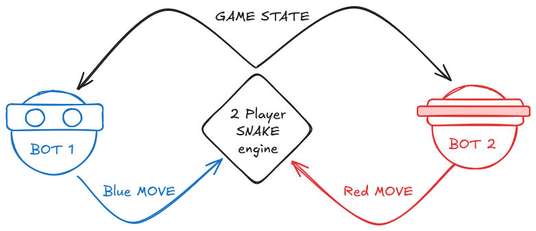

❗Deadline Extended: Sprint 3 deadline at 12 noon. [Updated on 15.02.26 02:42]

❗Rule Update: You cannot access the internet. [Updated on 10.02.26 17:25]

❗Rule Update: Size limit of 10 MB for submission. [Updated on 09.02.26 14:54]


✅Bug fix: `test_match.bat` handles default values correctly now. [Updated on 09.02.26 14:54]

# Beat my Bot v1 - Game Ssspecifications

Welcome to the first ever **Beat my Bot** challenge.
We have made a game engine for the simple game of 2-player snake. Now it is your job to write a bot to play the game optimally! Your bot must compete against others on the grid-based arena, collecting apples, avoiding obstacles, and outmaneuvering your opponent. Read this doc to understand the game and what you have to do in detail.

## But what is Beat My Bot?

Beat my Bot is a competitive agent programming challenge where you write a Python bot to play
2-player snake. Your bot communicates with our game engine through a simple request-
response cycle as shown in the image.



The engine sends the current game state (JSON) to both bots simultaneously. Your bot must
analyze the board, apples, opponent position, and obstacles, then responds with its move
decision (UP, DOWN, LEFT, or RIGHT). The engine executes both moves and updates the game
world. This cycle repeats until one snake dies or 500 turns complete.

You need not know the details of how the game engine works but are welcome to do so. You only need to:

- Read the game state (JSON input)
- Decide your move based on what you see
- Send your move back (JSON output)

Your bot is your player with perfect information about the board but no control over the rules. The
engine is the impartial referee that enforces all rules and keeps the game fair. And you are the
COACH! You must teach your bot the best strategy to WIN!

You can participate **individually** or in a **team of maximum 2 members**. Each team submits one bot. Register your team [here](https://docs.google.com/forms/d/e/1FAIpQLScZGOzJTZ9eWz8sNgBig5ds-bvxkmKpEabHolpawLsYydMARg/viewform?usp=dialog).

## Timeline

- **09/02** - Start of Competition. The codebase and gamerules will be shared. There will be an orientation at night.
- **11/02** - Sprint 1 submission! You can submit your code to us for testing against other bots. You will get back the replay files of your battles against other submissions by the next day. This will help you understand the meta of the game and you can try to deduce what others are developing.
- **13/02** - Sprint 2 submission!
- **15/02 (~~10 AM~~ 12 noon)** - Sprint 3 submission!
- **15/02 (6 PM)** - Final submissions. Note: We require you to have submitted your bot to atleast one of the Sprints to count your final submission.
- **15/02 (10 PM)** - We will gather to watch how the tournament plays out!

---

So now that you understand the what the competition is about lets is dive into the game rules

## Game Rules - 2 Player Snake

### Basic Mechanics

The game is played on a square grid which varies from 20x20 to 40x40. Each player controls one snake and both snakes move simultaneously each turn. Your bot has **500ms** (judge's-laptop) to respond each turn. To simulate it on your laptop, you can calibrate ([calibrate.py](tools/calibrate.py)) and scale by comparing with [reference](tools/reference_calibrate.json).

### Winning Conditions

The game ends and a winner is determined when:

- **One snake dies**: The surviving snake wins the match.
- **Maximum turns reached**: The game stops when 500 turns are done. Winner is determined by length: longer snake wins the match.

Your goal is simple: **survive longer than your opponent while maximizing your snake's length!**

### Sssnake

Your snake can move in four **directions**: UP, DOWN, LEFT, or RIGHT. However, **180° turns are not allowed** - you cannot reverse directly (e.g., if moving RIGHT, you cannot immediately go LEFT). If you don't send a move command or it times out, your snake will maintain its current direction. Beware of Speed and Sleep mechanic when handling movement (see Apples).

#### Energy Sssystem

Snake must maintain its energy level above 0. It begins with a starting energy of 60. Every turn, your snake experiences **energy depletion** at of 1 point per turn. The good news is that eating **any** apple restores your energy back to 60, regardless of the apple type. However, be warned: if your energy reaches 0 your snake will die from hunger and lose.

#### Death

Your snake dies if it:

- **Hits a wall** - Moves outside the grid boundaries (x < 0, x >= width, y < 0, or y >= height)
- **Hits itself** - Your head collides with any segment of your own body
- **Hits opponent's body** - Your head collides with any part of the opponent's snake (except in head-to-head)
- **Hits a map obstacle** - Moving into a static obstacle placed on the map
- **Starves** - Your energy reaches 0 from not eating apples
- **Loses head-to-head collision** - When both snake heads move to the same position the longer snake survives and the shorter snake dies. If snakes are of equal length, both snakes die and the match is declared a draw.

### Apples

Apples spawn on empty cells. You may get special apples which grant various effects when eaten. All apples restore energy to 60.

| Type | Symbol | Effect | Score | Spawn Rate |
|------|--------|--------|-------|------------|
| **NORMAL** | `A` | Grow by 1 segment | +1 | 60% |
| **GOD** | `D` | Grow by 3 segments | +3 | 15% |
| **SPEED** | `S` | 2 steps/turn for 5 turns. The 2 steps will be in same direction | +1 | 15% |
| **SLEEP** | `Z` | Freeze **opponent** for 5 turns | +1 | 5% |
| **POISON** | `P` | Shrink by 1 segment | -1 | 5% |

### Apple Sssspawning

We use a **zone-based spawning system** to ensure fair apple distribution. The grid is dynamically divided into three zones based on Manhattan distance from each snake's head: positions closer to your snake, positions closer to your opponent's snake, and neutral positions (within 3 tiles of being equidistant). When a new apple needs to spawn, the engine counts how many apples currently exist in each zone and spawns the new apple in the zone with the *fewest apples* on a *random* empty location. This reduces luck-based advantages. The zones shift dynamically as snakes move around the board, continuously adapting to maintain balance. Think about ways to use this to your advantage! NOTE: Apples will never spawn on snake bodies, map obstacles, or existing apples - only on empty cells.

## About your Bot

### Prerequisites

Before creating your bot, make sure you have:

- **Python 3.12** installed on your machine
- **Docker Desktop** installed (see Docker Setup in Appendix)
- **Go 1.21+** installed (the engine is written in Go)
- Understanding of the game rules described above

In most cases, you do not need to build the engine manually. The test scripts automatically build the engine binary before running a match (see Testing). If you still want to build it yourself, run: `go build -o bin/snakegame main.go`. On Windows, this creates `bin/snakegame.exe`. On Linux/Mac, it creates `bin/snakegame`.

#### Input (Game State)

Each turn, your bot receives the current game state as JSON via stdin. It looks something like this:

```json
{
"turn": 5,
"grid_width": 20,
"grid_height": 20,
"snakes": [ snakey stuff (see below) ],
"apples": [ yummy stuff (see below)],
"map": { serious stuff (see below) },
"winner": 0,
"game_over": false
}
```

The game state is sent from your bot's perspective. Your snake is always at index 0 in the `snakes` array, and your opponent is always at index 1. The engine automatically reorders the data before sending it to each bot, ensuring this consistent view. Within each snake's body array, `body[0]` i.e. position at index 0 represents the head, with subsequent elements representing body segments from neck to tail.

#### Output (Your Move)

Your bot must respond with a JSON object containing your move:

```json
{"move": "UP"}
```

Valid moves: `"UP"`, `"DOWN"`, `"LEFT"`, `"RIGHT"`

### Game Ssstate Fields Explained

#### Snake Object

```json
{
  "id": 1,                    // Snake identifier (1 or 2)
  "body": [...],              // Array of positions, [0] is head
  "direction": "UP",          // Current direction
  "alive": true,              // Is snake alive?
  "length": 5,                // Current length
  "score": 3,                 // Total score from apples
  "speed_turns": 0,           // Remaining turns with 2x speed
  "sleep_turns": 0,           // Remaining turns frozen
  "energy": 57,               // Current energy (dies at 0)
  "death_reason": ""          // Reason if dead, not useful to bot :)
}
```

##### Apple Object

```json
{
  "x": 10,                    // X coordinate
  "y": 15,                    // Y coordinate
  "type": "GOD"               // NORMAL, GOD, SPEED, SLEEP, or POISON
}
```

##### Map Object

```json
{
  "width": 20,                // Grid width
  "height": 20,               // Grid height
  "obstacles": [...]          // Static obstacle positions
}
```

#### Technical Specifications

- **Origin** (0, 0) is at **top-left**
- **X increases** going **RIGHT**
- **Y increases** going **DOWN**
- Your bot must respond in 500ms.If your bot doesn't respond in 500ms, it continues in current direction.
- The zipped folder you submit must not be larger than 10 MB.
- You cannot access the internet or instantate more processes. 

## Creating Your Bot

### Quick Start:

To participate in the competition, follow these steps:

1. **Clone** this repository to your local machine
2. Inside the `bots/` folder, **make a copy** of `example_python/` and rename it to `your_team_name/`
3. **Update** the `name` field in `config.json` to your team name
4. **Implement** your bot strategy by modifying `bot.py` (Python 3.12)
5. **Add dependencies** to `requirements.txt` if you need external packages (e.g., `numpy`, `scipy`)
6. **Set up Docker** for your bot (If you donot have docker installed, see Docker Setup in Apendix):
   - Windows: `.\scripts\create_dockerfile.ps1 -BotDir .\.bots\your_team_name`
   - Linux/Mac: `./scripts/create_dockerfile.sh ./bots/your_team_name`
7. **Update** `config.json` with Docker settings (add `docker_image`, `docker_cpus`, `docker_memory` fields)
8. **Test** your bot locally using the test scripts
9. **Submit** by compressing your team folder into a `.zip` file and submitting it through the **Google Form**

This approach gives you a working template to start from, so you can focus on strategy rather than setup! Remember the following restricitions when developing:
- Bot must respond in 500ms.
- Size of bot folder must be less than 10MB.
---

The following sections are mainly tricks and tips to help you develop your bot.

## Implementation Help

Our goal for out bot is as follows:

1. **Read from stdin** - Parse JSON game state
2. **Write to stdout** - Output JSON move decision
3. **Flush output** - Ensure immediate output (unbuffered)
4. **Respond quickly** - Within 500ms timeout
5. **Handle errors** - Graceful failure with valid move
   Do try to understand the code in bots/example_python/ for a working example

### Debugging

Debugging your bot can be tricky since it communicates via stdin/stdout. Fortunately, **stderr (standard error)** is your debugging tool!

#### How stderr Works?

**stdout** is used for bot communication (JSON moves) with the engine. So you cannot use it to print debugging. **stderr** is captured separately and logged to a file in your bot's directory. Writing to stderr **does not interfere** with your bot's communication and you can use it for print debugging. After running a match, check your bot's folder for the stderr log file:
`bots/your_bot_name/stderr.txt`

**Basic Debug Printing:**

```python
import sys

# Print debug messages
print("Bot started!", file=sys.stderr, flush=True)
print(f"Current turn: {game_state['turn']}", file=sys.stderr, flush=True)
```

**Debug Errors:**

```python
try:
    # Your bot logic
    move = calculate_move(game_state)
except Exception as e:
    print(f"ERROR: {e}", file=sys.stderr, flush=True)
    import traceback
    traceback.print_exc(file=sys.stderr)
    move = "UP"  # Fallback move
```

### Testing

Before testing, ensure you have set up Docker for your bot. If you have Docker installed, run:
Windows: `.\scripts\create_dockerfile.ps1 -BotDir .\bots\your_bot_name`
Linux/Mac: `./scripts/create_dockerfile.sh ./bots/your_bot_name`

Use the provided test scripts to run matches locally:

Windows: `.\scripts\test_match.bat [bot1] [bot2] [map] `
Linux/Mac: `./scripts/test_match.sh [bot1] [bot2] [map]`

Dont Forget the following while testing:

- Bot logs (stderr) are redirected to text files in each bot's folder (e.g., `bots/your_bot/stderr.txt`)
- Match replay is saved to `replays/match_replay.json`You must rename your replay if you wish to save it, or it will be overwritten by the next match you run. To see the replay, use the Ssssimulator.

### Ssssimulator

Use simulator to watch replays and understand what your bot is good at and where it lacks.

Windows - Extract the rar file. Run Ssssimulator.exe. It will run an example match. Save your match JSONs in the Replays folder. They will show up in the dropdown in the simulator.

Linux - Extract the rar file. Run Beat my Bot Linux Ssssimulator .x86_64. Save your JSONs in the Replays folder

Mac - same old thing. Save in replays folder

### Improving

Iterative development is key to building a strong bot. Here's a recommended workflow:

**Phase 1: Baseline Testing**
Start by testing your initial bot (let's call it `v1`) against `example_python` on all available maps:

```bash
.\scripts\test_match.bat my_bot_v1 example_python maps/4.json
.\scripts\test_match.bat my_bot_v1 example_python maps/large.json
.\scripts\test_match.bat my_bot_v1 example_python maps/newTest.json
.\scripts\test_match.bat my_bot_v1 example_python maps/x.json
```

Run multiple matches (5-10 per map) to get consistent results. Analyze replays using the visualizer to identify weaknesses in your strategy.

**Phase 2: Iterative Improvement**
Once your `v1` bot starts winning consistently against `example_python` across all maps, it's time to improve:

1. **Create a copy** of your bot folder: `my_bot_v2`
2. **Implement improvements** in `v2` (better pathfinding, apple prioritization, opponent prediction, etc.)
3. **Test v2 against v1** to measure improvements:
   ```bash
   .\scripts\test_match.bat my_bot_v2 my_bot_v1 maps/large.json
   ```
4. **Analyze results**: If v2 wins consistently, it becomes your new baseline. If not, iterate on v2 or revert to v1.

**Phase 3: Repeat**
Continue this cycle: v2 → v3 → v4, always testing new versions against your best performing previous version. This ensures each iteration is actually better, not just different.

## Sssssubmission Format

Submit your bot via **Google Form**:

1. Create a folder named `team_name/` containing:
   - `config.json` - Bot configuration with Docker settings
   - `bot.py` - Your bot implementation (Python 3.12 only)
   - `Dockerfile` - Generated via create_dockerfile script
   - `requirements.txt` - Python dependencies
   - (Optional) `README.md` - Strategy explanation
2. **Compress** your team folder into a `.zip` file (e.g., `team_digis.zip`)
3. **Submit** the zip file (not more than 10MB) through the Google Form link which will be provided by us later.

Example structure:

```
team_digis.zip
  ├── config.json
  ├── bot.py
  ├── Dockerfile
  ├── requirements.txt
  └── README.md (optional)
```

---

**Good luck, and may your snake survive the longest!** 🐍

---
The Specs are subject to change . Our decision will be the final decision in case of any dispute.

We have developed the backend for the first time. Some bugs are bound to be missed. If you find any please report to Siddhesh (7447454514; siddhesh.umarjee@iitgn.ac.in) or anyone from Digis. 

## Appendix

### Docker Setup

Docker containerizes your bot for consistent execution across different machines. We require Docker for official matches.

#### Prerequisites

Install Docker Desktop:

- **Windows/Mac**: Download from [docker.com](https://www.docker.com/products/docker-desktop)
- **Linux**: Install via package manager: `sudo apt-get install docker.io` (Ubuntu/Debian)

Verify installation:

```bash
docker --version
```

#### Creating Your Docker Bot

Use the provided script to generate Docker files and build your image:

**Windows:**

```powershell
.\scripts\create_dockerfile.ps1 -BotDir .\.bots\your_team_name
```

**Linux/Mac:**

```bash
./scripts/create_dockerfile.sh ./bots/your_team_name
```

This automatically:

- Creates `Dockerfile` with Python 3.12
- Creates `requirements.txt` template (if missing)
- Creates `.dockerignore` for cleaner builds
- Builds the Docker image

#### Configuring Docker in config.json

Update your `config.json` to use the Docker image:

```json
{
  "command": ["python", "-u", "bot.py"],
  "name": "Your Bot Name",
  "docker_image": "your-team-bot",
  "docker_cpus": 0.5,
  "docker_memory": "256m"
}
```

The engine will automatically run your bot in Docker when `docker_image` is specified. The `docker_cpus` and `docker_memory` fields limit resources for fair competition.

#### Testing Your Docker Bot

Test the image directly: `docker run --rm -i your-team-bot`

Or run matches with the engine (automatically uses Docker from config.json):

```bash
.\bin\snakegame.exe -bot1 your_team_name -bot2 example_python -verbose
```
